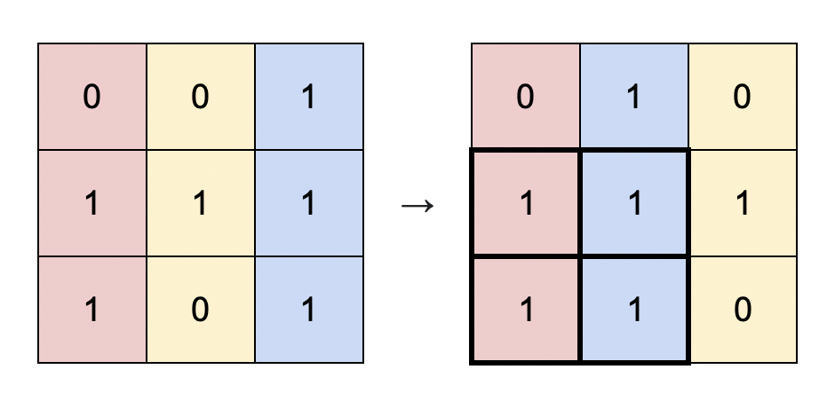
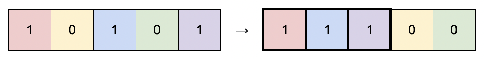
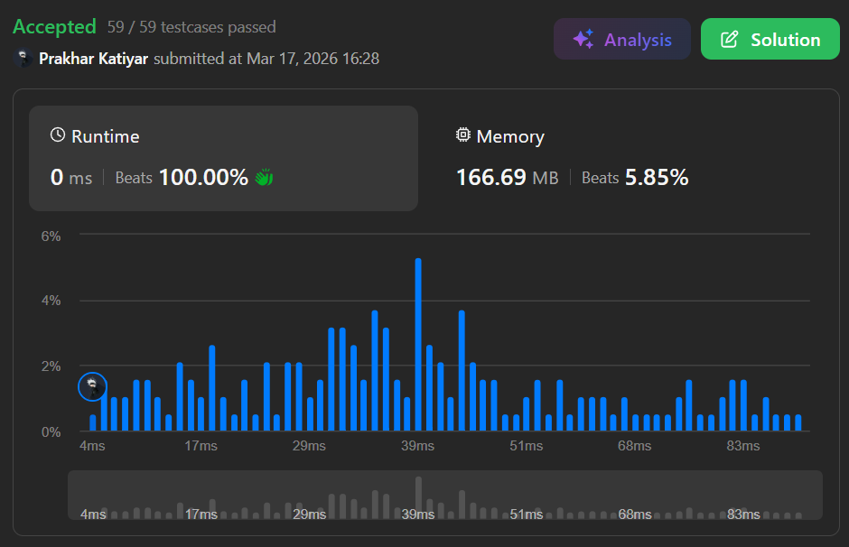

# 1727. Largest Submatrix With Rearrangements

 

<h2 align="center"> 

<a href="https://leetcode.com/problems/largest-submatrix-with-rearrangements/description/?envType=daily-question&envId=2026-03-17"><strong>➥ ☢️ 1727 Leetcode Medium ☢️ </strong></a>
</h2>

 

# Description 📜 ˋ°•*⁀➷
### You are given a **binary matrix** `matrix` of size `m x n`, and you are allowed to **rearrange the columns** of the `matrix` in any order.
### Return the **area of the largest submatrix** within `matrix` where every element of the submatrix is `1` after reordering the columns **optimally**.

 

# Example 💡 1️⃣ ˋ°•*⁀➷

  ### 📥 `Input`  ➤ matrix = [[0,0,1],[1,1,1],[1,0,1]]
  ### 📤 `Output`  ➤ 4
  ### 🔦 `Explanation`  ➤ You can rearrange the columns as shown above. The largest submatrix of 1s, in bold, has an area of 4.

 

# Example 💡 2️⃣ ˋ°•*⁀➷

  ### 📥 `Input` ➤ matrix = [[1,0,1,0,1]]
  ### 📤 `Output`  ➤ 3
  ### 🔦 `Explanation` ➤ You can rearrange the columns as shown above. The largest submatrix of 1s, in bold, has an area of 3.

 

# Example 💡 3️⃣ ˋ°•*⁀➷
  ### 📥 `Input` ➤ matrix = [[1,1,0],[1,0,1]]
  ### 📤 `Output`  ➤ 2
  ### 🔦 `Explanation` ➤ Notice that you must rearrange **entire columns**, and there is no way to make a submatrix of 1s larger than an area of 2.

 

# Constraints 🔒 ˋ°•*⁀➷
🔹 `m == matrix.length`  
🔹 `n == matrix[i].length`  
🔹 `1 <= m * n <= 10^5`  
🔹 `matrix[i][j]` is either `0` or `1`.  

 

# Topics 📋 ˋ°•*⁀➷
🔸 **Array**  
🔸 **Greedy**  
🔸 **Sorting**  
🔸 **Matrix**  

 

# Solution ✏️ ˋ°•*⁀➷

| 📒 Language 📒  | 🪶 Solution 🪶 |
| ------------- | ------------- |
|    | [JAVA🍁](https://github.com/Prakhar-002/LEETCODE/blob/main/%F0%9F%8E%AD%20LEVEL%20wise%20que%20with%20solution%20%F0%9F%8E%AF/%E2%98%A2%EF%B8%8F%20Medium%20%E2%98%A2%EF%B8%8F/%E2%98%A2%EF%B8%8F%20Medium%201727.%20Largest%20Submatrix%20With%20Rearrangements%20%E2%98%83%EF%B8%8F%20%F0%9F%8D%81%20%F0%9F%8D%B0%20%F0%9F%8E%B2/%F0%9F%8D%81JAVA%20-%201727.%20Largest%20Submatrix%20With%20Rearrangements.java) |
|    | [C++🎲](https://github.com/Prakhar-002/LEETCODE/blob/main/%F0%9F%8E%AD%20LEVEL%20wise%20que%20with%20solution%20%F0%9F%8E%AF/%E2%98%A2%EF%B8%8F%20Medium%20%E2%98%A2%EF%B8%8F/%E2%98%A2%EF%B8%8F%20Medium%201727.%20Largest%20Submatrix%20With%20Rearrangements%20%E2%98%83%EF%B8%8F%20%F0%9F%8D%81%20%F0%9F%8D%B0%20%F0%9F%8E%B2/%F0%9F%8E%B2CPP%20-%201727.%20Largest%20Submatrix%20With%20Rearrangements.cpp)  |
|      | [PYTHON🍰](https://github.com/Prakhar-002/LEETCODE/blob/main/%F0%9F%8E%AD%20LEVEL%20wise%20que%20with%20solution%20%F0%9F%8E%AF/%E2%98%A2%EF%B8%8F%20Medium%20%E2%98%A2%EF%B8%8F/%E2%98%A2%EF%B8%8F%20Medium%201727.%20Largest%20Submatrix%20With%20Rearrangements%20%E2%98%83%EF%B8%8F%20%F0%9F%8D%81%20%F0%9F%8D%B0%20%F0%9F%8E%B2/%F0%9F%8D%B0PYTHON%20-%201727.%20Largest%20Submatrix%20With%20Rearrangements.py) |
|    | [JAVASCRIPT☃️](https://github.com/Prakhar-002/LEETCODE/blob/main/%F0%9F%8E%AD%20LEVEL%20wise%20que%20with%20solution%20%F0%9F%8E%AF/%E2%98%A2%EF%B8%8F%20Medium%20%E2%98%A2%EF%B8%8F/%E2%98%A2%EF%B8%8F%20Medium%201727.%20Largest%20Submatrix%20With%20Rearrangements%20%E2%98%83%EF%B8%8F%20%F0%9F%8D%81%20%F0%9F%8D%B0%20%F0%9F%8E%B2/%E2%98%83%EF%B8%8FJAVASCRIPT%20-%201727.%20Largest%20Submatrix%20With%20Rearrangements.js) |

 

# Benchmark ⏱️ ˋ°•*⁀➷

<h1  align="center" >

</h1>
