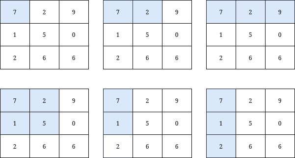
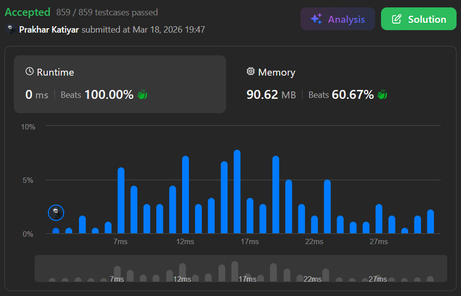

# 3070. Count Submatrices with Top-Left Element and Sum Less Than k

 

<h2 align="center"> 

<a href="https://leetcode.com/problems/count-submatrices-with-top-left-element-and-sum-less-than-k/description/?envType=daily-question&envId=2026-03-18"><strong>➥ ☢️ 3070 Leetcode Medium ☢️ </strong></a>
</h2>

 

# Description 📜 ˋ°•*⁀➷
### You are given a **0-indexed** integer matrix `grid` and an integer `k`.
### Return the **number of submatrices** that contain the **top-left element** of the `grid`, and have a **sum less than or equal to** `k`.

 

# Example 💡 1️⃣ ˋ°•*⁀➷

  ### 📥 `Input`  ➤ grid = [[7,6,3],[6,6,1]], k = 18
  ### 📤 `Output`  ➤ 4
  ### 🔦 `Explanation`  ➤ There are only 4 submatrices, shown in the image above, that contain the top-left element of grid, and have a sum less than or equal to 18.

 

# Example 💡 2️⃣ ˋ°•*⁀➷

  ### 📥 `Input` ➤ grid = [[7,2,9],[1,5,0],[2,6,6]], k = 20
  ### 📤 `Output`  ➤ 6
  ### 🔦 `Explanation` ➤ There are only 6 submatrices, shown in the image above, that contain the top-left element of grid, and have a sum less than or equal to 20.

 

# Example 💡 3️⃣ ˋ°•*⁀➷
  ### 📥 `Input` ➤ grid = [[1,1],[1,1]], k = 4
  ### 📤 `Output`  ➤ 4
  ### 🔦 `Explanation` ➤ All 4 submatrices starting from the top-left have sums 1, 2, 2, and 4 — all ≤ 4, so the answer is 4.

 

# Constraints 🔒 ˋ°•*⁀➷
🔹 `m == grid.length`  
🔹 `n == grid[i].length`  
🔹 `1 <= n, m <= 1000`  
🔹 `0 <= grid[i][j] <= 1000`  
🔹 `1 <= k <= 10^9`  

 

# Topics 📋 ˋ°•*⁀➷
🔸 **Array**  
🔸 **Matrix**  
🔸 **Prefix Sum**  

 

# Solution ✏️ ˋ°•*⁀➷

| 📒 Language 📒  | 🪶 Solution 🪶 |
| ------------- | ------------- |
|    | [JAVA🍁](https://github.com/Prakhar-002/LEETCODE/blob/main/%F0%9F%8E%AD%20LEVEL%20wise%20que%20with%20solution%20%F0%9F%8E%AF/%E2%98%A2%EF%B8%8F%20Medium%20%E2%98%A2%EF%B8%8F/%E2%98%A2%EF%B8%8F%20Medium%203070.%20Count%20Submatrices%20with%20Top-Left%20Element%20and%20Sum%20Less%20Than%20k%20%E2%98%83%EF%B8%8F%20%F0%9F%8D%81%20%F0%9F%8D%B0%20%F0%9F%8E%B2/%F0%9F%8D%81JAVA%20-%203070.%20Count%20Submatrices%20with%20Top-Left%20Element%20and%20Sum%20Less%20Tha.java) |
|    | [C++🎲](https://github.com/Prakhar-002/LEETCODE/blob/main/%F0%9F%8E%AD%20LEVEL%20wise%20que%20with%20solution%20%F0%9F%8E%AF/%E2%98%A2%EF%B8%8F%20Medium%20%E2%98%A2%EF%B8%8F/%E2%98%A2%EF%B8%8F%20Medium%203070.%20Count%20Submatrices%20with%20Top-Left%20Element%20and%20Sum%20Less%20Than%20k%20%E2%98%83%EF%B8%8F%20%F0%9F%8D%81%20%F0%9F%8D%B0%20%F0%9F%8E%B2/%F0%9F%8E%B2CPP%20-%203070.%20Count%20Submatrices%20with%20Top-Left%20Element%20and%20Sum%20Less%20Than%20.cpp)  |
|      | [PYTHON🍰](https://github.com/Prakhar-002/LEETCODE/blob/main/%F0%9F%8E%AD%20LEVEL%20wise%20que%20with%20solution%20%F0%9F%8E%AF/%E2%98%A2%EF%B8%8F%20Medium%20%E2%98%A2%EF%B8%8F/%E2%98%A2%EF%B8%8F%20Medium%203070.%20Count%20Submatrices%20with%20Top-Left%20Element%20and%20Sum%20Less%20Than%20k%20%E2%98%83%EF%B8%8F%20%F0%9F%8D%81%20%F0%9F%8D%B0%20%F0%9F%8E%B2/%F0%9F%8D%B0PYTHON%20-%203070.%20Count%20Submatrices%20with%20Top-Left%20Element%20and%20Sum%20Less%20Tha.py) |
|    | [JAVASCRIPT☃️](https://github.com/Prakhar-002/LEETCODE/blob/main/%F0%9F%8E%AD%20LEVEL%20wise%20que%20with%20solution%20%F0%9F%8E%AF/%E2%98%A2%EF%B8%8F%20Medium%20%E2%98%A2%EF%B8%8F/%E2%98%A2%EF%B8%8F%20Medium%203070.%20Count%20Submatrices%20with%20Top-Left%20Element%20and%20Sum%20Less%20Than%20k%20%E2%98%83%EF%B8%8F%20%F0%9F%8D%81%20%F0%9F%8D%B0%20%F0%9F%8E%B2/%E2%98%83%EF%B8%8FJAVASCRIPT%20-%203070.%20Count%20Submatrices%20with%20Top-Left%20Element%20and%20Sum%20Less.js) |

 

# Benchmark ⏱️ ˋ°•*⁀➷

<h1  align="center" > 

</h1>
