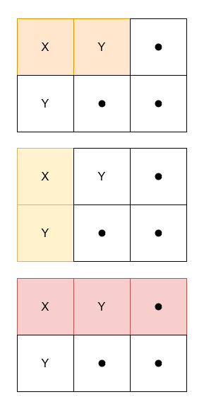
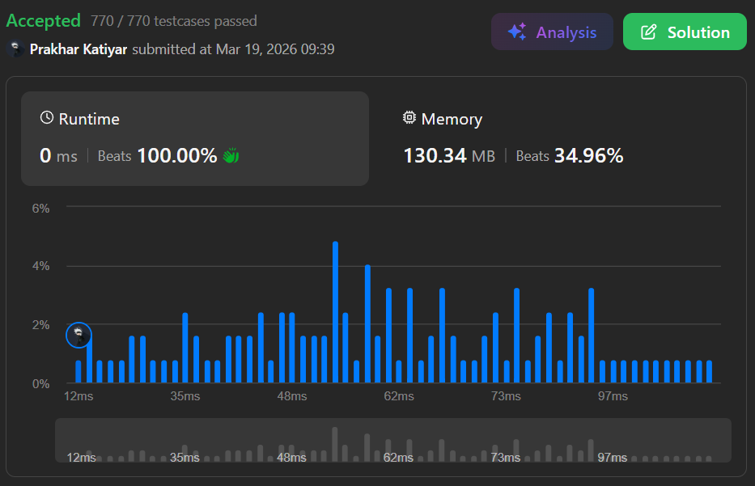

# 3212. Count Submatrices With Equal Frequency of X and Y

 

<h2 align="center"> 

<a href="https://leetcode.com/problems/count-submatrices-with-equal-frequency-of-x-and-y/description/?envType=daily-question&envId=2026-03-19"><strong>➥ ☢️ 3212 Leetcode Medium ☢️ </strong></a>
</h2>

 

# Description 📜 ˋ°•*⁀➷
### Given a 2D character matrix `grid`, where `grid[i][j]` is either `'X'`, `'Y'`, or `'.'`, return the **number of submatrices** that contain:
### &nbsp;&nbsp;&nbsp;&nbsp;• `grid[0][0]`
### &nbsp;&nbsp;&nbsp;&nbsp;• an **equal frequency** of `'X'` and `'Y'`.
### &nbsp;&nbsp;&nbsp;&nbsp;• at least one `'X'`.

 

# Example 💡 1️⃣ ˋ°•*⁀➷
  ### 📥 `Input`  ➤ grid = [["X","Y","."],["Y",".","."]]
  ### 📤 `Output`  ➤ 3
  ### 🔦 `Explanation`  ➤ There are 3 submatrices containing `grid[0][0]` with equal frequency of `'X'` and `'Y'` and at least one `'X'`.

 

# Example 💡 2️⃣ ˋ°•*⁀➷
  ### 📥 `Input` ➤ grid = [["X","X"],["X","Y"]]
  ### 📤 `Output`  ➤ 0
  ### 🔦 `Explanation` ➤ No submatrix has an equal frequency of `'X'` and `'Y'`.

 

# Example 💡 3️⃣ ˋ°•*⁀➷
  ### 📥 `Input` ➤ grid = [[".","."],[".","."]]
  ### 📤 `Output`  ➤ 0
  ### 🔦 `Explanation` ➤ No submatrix has at least one `'X'`.

 

# Constraints 🔒 ˋ°•*⁀➷
🔹 `1 <= grid.length, grid[i].length <= 1000`  
🔹 `grid[i][j]` is either `'X'`, `'Y'`, or `'.'`.  

 

# Topics 📋 ˋ°•*⁀➷
🔸 **Array**  
🔸 **Matrix**  
🔸 **Prefix Sum**  

 

# Solution ✏️ ˋ°•*⁀➷

| 📒 Language 📒  | 🪶 Solution 🪶 |
| ------------- | ------------- |
|    | [JAVA🍁]() |
|    | [C++🎲]()  |
|      | [PYTHON🍰]() |
|    | [JAVASCRIPT☃️]() |

 

# Benchmark ⏱️ ˋ°•*⁀➷

<h1  align="center" >

</h1>
