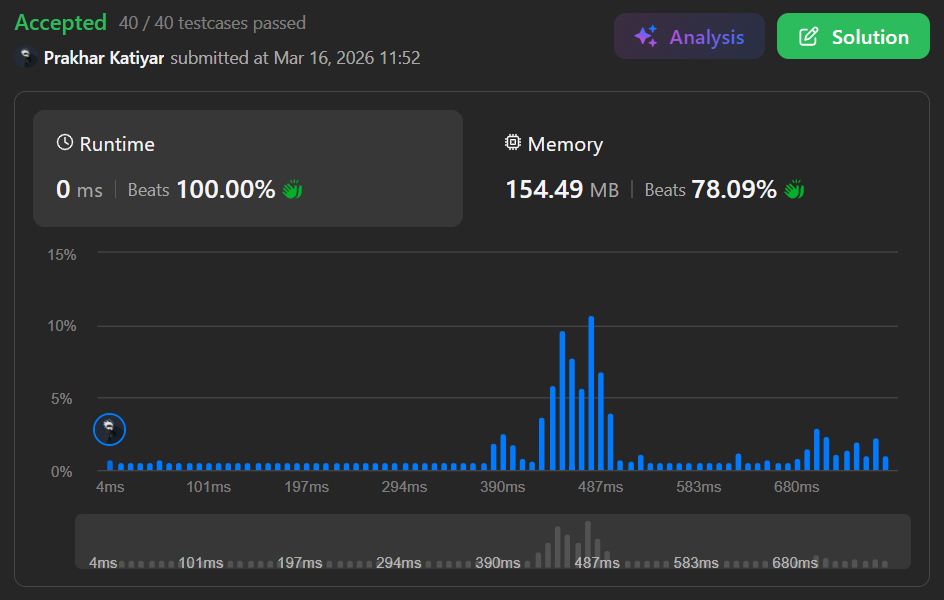

# 1074. Number of Submatrices That Sum to Target

 

<h2 align="center"> 

<a href="https://leetcode.com/problems/number-of-submatrices-that-sum-to-target/"><strong>➥ 🫀 1074 Leetcode Hard 🫀 </strong></a>
</h2>

 

# Description 📜 ˋ°•*⁀➷

### Given a **matrix** and a **target**, return the number of **non-empty submatrices** that sum to `target`.

### A **submatrix** `x1, y1, x2, y2` is the set of all cells `matrix[x][y]` where `x1 <= x <= x2` and `y1 <= y <= y2`.

### Two submatrices `(x1, y1, x2, y2)` and `(x1', y1', x2', y2')` are **different** if they have at least one coordinate that differs (e.g., `x1 != x1'`).

 

# Example 💡 1️⃣ ˋ°•*⁀➷

  ### 📥 `Input`  ➤ `matrix = [[0,1,0],[1,1,1],[0,1,0]], target = 0`

  ### 📤 `Output`  ➤ 4

  ### 🔦 `Explanation`  ➤ The four 1x1 submatrices that only contain 0.

 

# Example 💡 2️⃣ ˋ°•*⁀➷

### 📥 `Input` ➤ `matrix = [[1,-1],[-1,1]], target = 0`

### 📤 `Output`  ➤ `5`

### 🔦 `Explanation`  ➤ Two **1x2 submatrices** `[1,-1]` and `[-1,1]`, two **2x1 submatrices** `[1,-1]` and `[-1,1]`, plus the **2x2 submatrix**.

 

# Example 💡 3️⃣ ˋ°•*⁀➷

### 📥 `Input` ➤ `matrix = [[904]], target = 0`

### 📤 `Output`  ➤ `0`

### 🔦 `Explanation`  ➤ No submatrix sums to `0`.

 

# Constraints 🔒 ˋ°•*⁀➷

🔹 `1 <= matrix.length <= 100`  
🔹 `1 <= matrix[0].length <= 100`  
🔹 `-1000 <= matrix[i][j] <= 1000`  
🔹 `-10^8 <= target <= 10^8`  

 

# Topics 📋 ˋ°•*⁀➷

🔸 **Array**   
🔸 **Hash Table**   
🔸 **Matrix**   
🔸 **Prefix Sum**   

 

# Solution ✏️ ˋ°•*⁀➷

| 📒 Language 📒  | 🪶 Solution 🪶 |
| ------------- | ------------- |
|    | [JAVA🍁](https://github.com/Prakhar-002/LEETCODE/blob/main/%F0%9F%8E%AD%20LEVEL%20wise%20que%20with%20solution%20%F0%9F%8E%AF/%F0%9F%AB%80%20Hard%20%F0%9F%AB%80/%F0%9F%AB%80%20Hard%201074.%20Number%20of%20Submatrices%20That%20Sum%20to%20Target%20%E2%98%83%EF%B8%8F%20%F0%9F%8D%81%20%F0%9F%8D%B0%20%F0%9F%8E%B2/%F0%9F%8D%81JAVA%20-%201074.%20Number%20of%20Submatrices%20That%20Sum%20to%20Target.java) |
|    | [C++🎲](https://github.com/Prakhar-002/LEETCODE/blob/main/%F0%9F%8E%AD%20LEVEL%20wise%20que%20with%20solution%20%F0%9F%8E%AF/%F0%9F%AB%80%20Hard%20%F0%9F%AB%80/%F0%9F%AB%80%20Hard%201074.%20Number%20of%20Submatrices%20That%20Sum%20to%20Target%20%E2%98%83%EF%B8%8F%20%F0%9F%8D%81%20%F0%9F%8D%B0%20%F0%9F%8E%B2/%F0%9F%8D%B0PYTHON%20-%201074.%20Number%20of%20Submatrices%20That%20Sum%20to%20Target.py)  |
|      | [PYTHON🍰](https://github.com/Prakhar-002/LEETCODE/blob/main/%F0%9F%8E%AD%20LEVEL%20wise%20que%20with%20solution%20%F0%9F%8E%AF/%F0%9F%AB%80%20Hard%20%F0%9F%AB%80/%F0%9F%AB%80%20Hard%201074.%20Number%20of%20Submatrices%20That%20Sum%20to%20Target%20%E2%98%83%EF%B8%8F%20%F0%9F%8D%81%20%F0%9F%8D%B0%20%F0%9F%8E%B2/%F0%9F%8D%B0PYTHON%20-%201074.%20Number%20of%20Submatrices%20That%20Sum%20to%20Target.py) |
|    | [JAVASCRIPT☃️](https://github.com/Prakhar-002/LEETCODE/blob/main/%F0%9F%8E%AD%20LEVEL%20wise%20que%20with%20solution%20%F0%9F%8E%AF/%F0%9F%AB%80%20Hard%20%F0%9F%AB%80/%F0%9F%AB%80%20Hard%201074.%20Number%20of%20Submatrices%20That%20Sum%20to%20Target%20%E2%98%83%EF%B8%8F%20%F0%9F%8D%81%20%F0%9F%8D%B0%20%F0%9F%8E%B2/%E2%98%83%EF%B8%8FJAVASCRIPT%20-%201074.%20Number%20of%20Submatrices%20That%20Sum%20to%20Target.js) |

 

# Benchmark ⏱️ ˋ°•*⁀➷

<h1  align="center" >

</h1>
