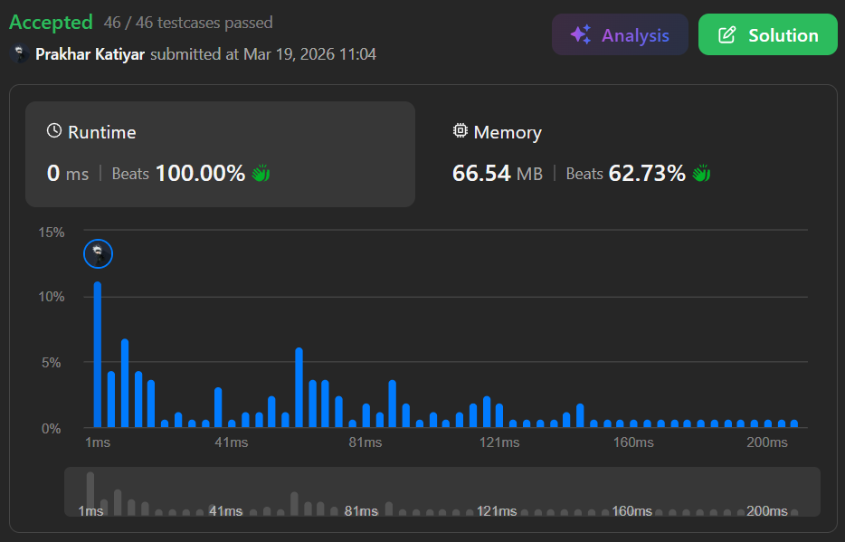

# 1224. Maximum Equal Frequency

 

<h2 align="center"> 

<a href="https://leetcode.com/problems/maximum-equal-frequency/description/"><strong>➥ 🫀 1224 Leetcode  Hard 🫀 </strong></a>
</h2>

 

# Description 📜 ˋ°•*⁀➷
### Given an array `nums` of positive integers, return the **longest possible length of an array prefix** of `nums`, such that it is possible to **remove exactly one element** from this prefix so that every number that has appeared in it will have the **same number of occurrences**.
### If after removing one element there are **no remaining elements**, it's still considered that every appeared number has the same number of occurrences (`0`).

 

# Example 💡 1️⃣ ˋ°•*⁀➷
  ### 📥 `Input`  ➤ nums = [2,2,1,1,5,3,3,5]
  ### 📤 `Output`  ➤ 7
  ### 🔦 `Explanation`  ➤ For the subarray [2,2,1,1,5,3,3] of length 7, if we remove nums[4] = 5, we will get [2,2,1,1,3,3], so that each number will appear exactly twice.

 

# Example 💡 2️⃣ ˋ°•*⁀➷
  ### 📥 `Input` ➤ nums = [1,1,1,2,2,2,3,3,3,4,4,4,5]
  ### 📤 `Output`  ➤ 13
  ### 🔦 `Explanation` ➤ The full array of length 13 is valid — removing the single `5` makes every remaining number appear exactly 3 times.

 

# Example 💡 3️⃣ ˋ°•*⁀➷
  ### 📥 `Input` ➤ nums = [1,2,3,4,5]
  ### 📤 `Output`  ➤ 1
  ### 🔦 `Explanation` ➤ The prefix [1] of length 1 is valid — removing the only element leaves an empty array, which trivially satisfies equal occurrences.

 

# Constraints 🔒 ˋ°•*⁀➷
🔹 `2 <= nums.length <= 10^5`  
🔹 `1 <= nums[i] <= 10^5`  

 

# Topics 📋 ˋ°•*⁀➷
🔸 **Array**  
🔸 **Hash Table**  

 

# Solution ✏️ ˋ°•*⁀➷

| 📒 Language 📒  | 🪶 Solution 🪶 |
| ------------- | ------------- |
|    | [JAVA🍁](https://github.com/Prakhar-002/LEETCODE/blob/main/%F0%9F%8E%AD%20LEVEL%20wise%20que%20with%20solution%20%F0%9F%8E%AF/%F0%9F%AB%80%20Hard%20%F0%9F%AB%80/%F0%9F%AB%80%20Hard%201224.%20Maximum%20Equal%20Frequency%20%E2%98%83%EF%B8%8F%20%F0%9F%8D%81%20%F0%9F%8D%B0%20%F0%9F%8E%B2/%F0%9F%8D%81JAVA%20-%201224.%20Maximum%20Equal%20Frequency.java) |
|    | [C++🎲](https://github.com/Prakhar-002/LEETCODE/blob/main/%F0%9F%8E%AD%20LEVEL%20wise%20que%20with%20solution%20%F0%9F%8E%AF/%F0%9F%AB%80%20Hard%20%F0%9F%AB%80/%F0%9F%AB%80%20Hard%201224.%20Maximum%20Equal%20Frequency%20%E2%98%83%EF%B8%8F%20%F0%9F%8D%81%20%F0%9F%8D%B0%20%F0%9F%8E%B2/%F0%9F%8E%B2CPP%20-%201224.%20Maximum%20Equal%20Frequency.cpp)  |
|      | [PYTHON🍰](https://github.com/Prakhar-002/LEETCODE/blob/main/%F0%9F%8E%AD%20LEVEL%20wise%20que%20with%20solution%20%F0%9F%8E%AF/%F0%9F%AB%80%20Hard%20%F0%9F%AB%80/%F0%9F%AB%80%20Hard%201224.%20Maximum%20Equal%20Frequency%20%E2%98%83%EF%B8%8F%20%F0%9F%8D%81%20%F0%9F%8D%B0%20%F0%9F%8E%B2/%F0%9F%8D%B0PYTHON%20-%201224.%20Maximum%20Equal%20Frequency.py) |
|    | [JAVASCRIPT☃️](https://github.com/Prakhar-002/LEETCODE/blob/main/%F0%9F%8E%AD%20LEVEL%20wise%20que%20with%20solution%20%F0%9F%8E%AF/%F0%9F%AB%80%20Hard%20%F0%9F%AB%80/%F0%9F%AB%80%20Hard%201224.%20Maximum%20Equal%20Frequency%20%E2%98%83%EF%B8%8F%20%F0%9F%8D%81%20%F0%9F%8D%B0%20%F0%9F%8E%B2/%E2%98%83%EF%B8%8FJAVASCRIPT%20-%201224.%20Maximum%20Equal%20Frequency.js) |

 

# Benchmark ⏱️ ˋ°•*⁀➷

<h1  align="center" > 

</h1>
