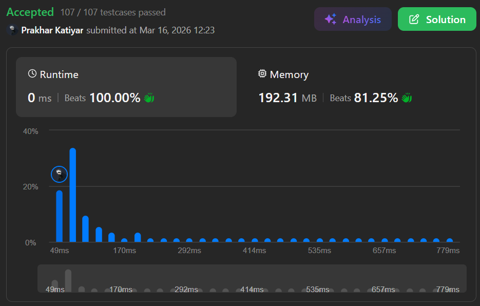

# 1622. Fancy Sequence

</br>

<h2 align="center"> 

<a href="https://leetcode.com/problems/fancy-sequence/description/?envType=daily-question&envId=2026-03-15"><strong>➥ 🫀 1622 Leetcode Hard 🫀 </strong></a>
</h2>

</br>

# Description 📜 ˋ°•*⁀➷

### Write an API that generates fancy sequences using the `append`, `addAll`, and `multAll` operations.

### `Fancy()` initializes the object with an **empty sequence**.

### `void append(val)` appends an integer `val` to the **end** of the sequence.

### `void addAll(inc)` increments **all existing values** in the sequence by an integer `inc`.

### `void multAll(m)` multiplies **all existing values** in the sequence by an integer `m`.

### `int getIndex(idx)` gets the current value at **0-indexed position** `idx` of the sequence **modulo** `10^9 + 7`. Returns `-1` if `idx` ≥ sequence length.

</br>

# Example 💡 1️⃣ ˋ°•*⁀➷

### 📥 `Input`  ➤  
`["Fancy", "append", "addAll", "append", "multAll", "getIndex", "addAll", "append", "multAll", "getIndex", "getIndex", "getIndex"]`  
`[[], [2], [3], [7], [2], [0], [3], [10], [2], [0], [1], [2]]`

### 📤 `Output`  ➤  
`[null, null, null, null, null, 10, null, null, null, 26, 34, 20]`

### 🔦 `Explanation`  ➤  

```Js
Fancy fancy = new Fancy();
fancy.append(2);   // fancy sequence: [2]
fancy.addAll(3);   // fancy sequence: [2+3] -> [5]
fancy.append(7);   // fancy sequence: [5, 7]
fancy.multAll(2);  // fancy sequence: [5*2, 7*2] -> [10, 14]
fancy.getIndex(0); // return 10
fancy.addAll(3);   // fancy sequence: [10+3, 14+3] -> [13, 17]
fancy.append(10);  // fancy sequence: [13, 17, 10]
fancy.multAll(2);  // fancy sequence: [13*2, 17*2, 10*2] -> [26, 34, 20]
fancy.getIndex(0); // return 26
fancy.getIndex(1); // return 34
fancy.getIndex(2); // return 20
```


</br>

# Constraints 🔒 ˋ°•*⁀➷

🔹 `1 <= val, inc, m <= 100` </br>
🔹 `0 <= idx <= 10^5` </br>
🔹 At most `10^5` calls total to `append`, `addAll`, `multAll`, and `getIndex`

</br>

# Topics 📋 ˋ°•*⁀➷

🔸 **Math**  </br>
🔸 **Design**  </br>
🔸 **Segment Tree**  </br>

</br>

# Solution ✏️ ˋ°•*⁀➷

| 📒 Language 📒  | 🪶 Solution 🪶 |
| ------------- | ------------- |
|    | [JAVA🍁](https://github.com/Prakhar-002/LEETCODE/blob/main/%F0%9F%8E%AD%20LEVEL%20wise%20que%20with%20solution%20%F0%9F%8E%AF/%F0%9F%AB%80%20Hard%20%F0%9F%AB%80/%F0%9F%AB%80%20Hard%201622.%20Fancy%20Sequence%20%E2%98%83%EF%B8%8F%20%F0%9F%8D%81%20%F0%9F%8D%B0%20%F0%9F%8E%B2/%F0%9F%8D%81JAVA%20-%201622.%20Fancy%20Sequence.java) |
|    | [C++🎲](https://github.com/Prakhar-002/LEETCODE/blob/main/%F0%9F%8E%AD%20LEVEL%20wise%20que%20with%20solution%20%F0%9F%8E%AF/%F0%9F%AB%80%20Hard%20%F0%9F%AB%80/%F0%9F%AB%80%20Hard%201622.%20Fancy%20Sequence%20%E2%98%83%EF%B8%8F%20%F0%9F%8D%81%20%F0%9F%8D%B0%20%F0%9F%8E%B2/%F0%9F%8E%B2CPP%20-%201622.%20Fancy%20Sequence.cpp)  |
|      | [PYTHON🍰](https://github.com/Prakhar-002/LEETCODE/blob/main/%F0%9F%8E%AD%20LEVEL%20wise%20que%20with%20solution%20%F0%9F%8E%AF/%F0%9F%AB%80%20Hard%20%F0%9F%AB%80/%F0%9F%AB%80%20Hard%201622.%20Fancy%20Sequence%20%E2%98%83%EF%B8%8F%20%F0%9F%8D%81%20%F0%9F%8D%B0%20%F0%9F%8E%B2/%F0%9F%8D%B0PYTHON%20-%201622.%20Fancy%20Sequence.py) |
|    | [JAVASCRIPT☃️](https://github.com/Prakhar-002/LEETCODE/blob/main/%F0%9F%8E%AD%20LEVEL%20wise%20que%20with%20solution%20%F0%9F%8E%AF/%F0%9F%AB%80%20Hard%20%F0%9F%AB%80/%F0%9F%AB%80%20Hard%201622.%20Fancy%20Sequence%20%E2%98%83%EF%B8%8F%20%F0%9F%8D%81%20%F0%9F%8D%B0%20%F0%9F%8E%B2/%E2%98%83%EF%B8%8FJAVASCRIPT%20-%201622.%20Fancy%20Sequence.js) |

</br>

# Benchmark ⏱️ ˋ°•*⁀➷

<h1  align="center" >



</h1>
