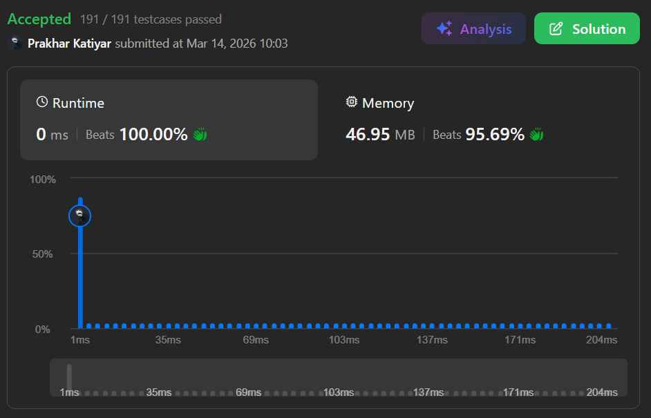

# Q1 Maximum Product Subarray

 

<h2 align="center"> 

<a href="https://leetcode.com/problems/maximum-product-subarray/description/?envType=problem-list-v2&envId=interview-instance-iv"><strong>➥ ☢️ Q1 Leetcode Medium ☢️ </strong></a>
</h2>

 

# Description 📜 ˋ°•*⁀➷

### Given an integer array `nums`, find a **subarray** that has the **largest product** and return the product.

### The test cases are generated so that the answer will fit in a **32-bit integer**.

### Note that the product of an array with a **single element** is the value of that element itself.

 

# Example 💡 1️⃣ ˋ°•*⁀➷

### 📥 `Input`  ➤ `nums = [2,3,-2,4]`

### 📤 `Output`  ➤ `6`

### 🔦 `Explanation`  ➤ Subarray `[2,3]` has the largest product `6`.

 

# Example 💡 2️⃣ ˋ°•*⁀➷

### 📥 `Input` ➤ `nums = [-2,0,-1]`

### 📤 `Output`  ➤ `0`

### 🔦 `Explanation`  ➤ The largest product is `0`. Note that `[-2,-1]` is **not** a subarray (not contiguous).

 

# Constraints 🔒 ˋ°•*⁀➷

🔹 `1 <= nums.length <= 2 * 10^4`  
🔹 `-10 <= nums[i] <= 10`  
🔹 Product of any subarray fits in a **32-bit integer**

 

# Topics 📋 ˋ°•*⁀➷

🔸 **Array**   
🔸 **Dynamic Programming**   

 

# Solution ✏️ ˋ°•*⁀➷

| 📒 Language 📒  | 🪶 Solution 🪶 |
| ------------- | ------------- |
|    | [JAVA🍁](https://github.com/Prakhar-002/LEETCODE/blob/main/%F0%9F%8F%95%EF%B8%8F%20Quest%20%F0%9F%A7%89/%F0%9F%8D%84%E2%80%8D%F0%9F%9F%AB%20Expedition%20Campaign%202026%20%F0%9F%A6%84/%F0%9F%94%AC%20Examine%20Thoroughly%20%F0%9F%A7%AC/2%20Fighting/Interview%20Instance%204/Q1.%20Maximum%20Product%20Subarray/%F0%9F%8D%81JAVA%20-%20Maximum%20Product%20Subarray.java) |
|    | [C++🎲](https://github.com/Prakhar-002/LEETCODE/blob/main/%F0%9F%8F%95%EF%B8%8F%20Quest%20%F0%9F%A7%89/%F0%9F%8D%84%E2%80%8D%F0%9F%9F%AB%20Expedition%20Campaign%202026%20%F0%9F%A6%84/%F0%9F%94%AC%20Examine%20Thoroughly%20%F0%9F%A7%AC/2%20Fighting/Interview%20Instance%204/Q1.%20Maximum%20Product%20Subarray/%F0%9F%8E%B2CPP%20-%20Maximum%20Product%20Subarray.cpp)  |
|      | [PYTHON🍰](https://github.com/Prakhar-002/LEETCODE/blob/main/%F0%9F%8F%95%EF%B8%8F%20Quest%20%F0%9F%A7%89/%F0%9F%8D%84%E2%80%8D%F0%9F%9F%AB%20Expedition%20Campaign%202026%20%F0%9F%A6%84/%F0%9F%94%AC%20Examine%20Thoroughly%20%F0%9F%A7%AC/2%20Fighting/Interview%20Instance%204/Q1.%20Maximum%20Product%20Subarray/%F0%9F%8D%B0PYTHON%20-%20Maximum%20Product%20Subarray.py) |
|    | [JAVASCRIPT☃️](https://github.com/Prakhar-002/LEETCODE/blob/main/%F0%9F%8F%95%EF%B8%8F%20Quest%20%F0%9F%A7%89/%F0%9F%8D%84%E2%80%8D%F0%9F%9F%AB%20Expedition%20Campaign%202026%20%F0%9F%A6%84/%F0%9F%94%AC%20Examine%20Thoroughly%20%F0%9F%A7%AC/2%20Fighting/Interview%20Instance%204/Q1.%20Maximum%20Product%20Subarray/%E2%98%83%EF%B8%8FJAVASCRIPT%20-%20Maximum%20Product%20Subarray.js) |

 

# Benchmark ⏱️ ˋ°•*⁀➷

<h1  align="center" >

</h1>
