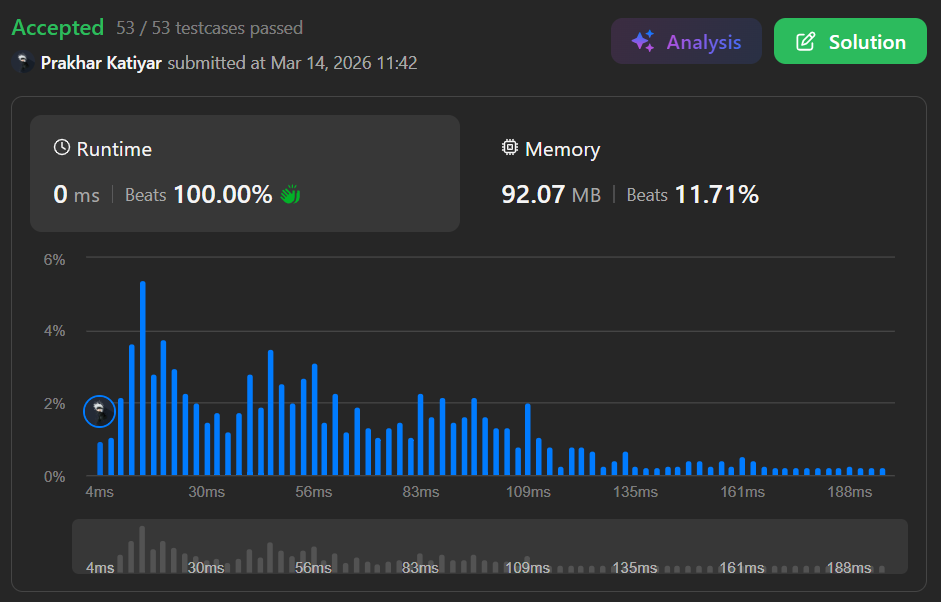

# Q3. Cinema Seat Allocation

 

<h2 align="center"> 

<a href="https://leetcode.com/problems/cinema-seat-allocation/description/?envType=problem-list-v2&envId=interview-instance-iv"><strong>➥ ☢️ Q3 Leetcode Medium ☢️ </strong></a>
</h2>

 

# Description 📜 ˋ°•*⁀➷

### A cinema has `n` rows of seats, numbered from `1` to `n`, and each row has `10` seats labeled from `1` to `10`. You are given `reservedSeats`, where `reservedSeats[i] = [row, seat]` indicates that this seat is already reserved. A four-person group must occupy four **adjacent** seats in a single row, but seats across an aisle (like seats `3` and `4`, or `7` and `8`) are not adjacent unless the group is split with **two people on each side of the aisle**.

### Return the **maximum number** of four-person groups that can be assigned to the cinema using only unreserved seats.

 

# Example 💡 1️⃣ ˋ°•*⁀➷

### 📥 `Input`  ➤ `n = 3, reservedSeats = [[1,2],[1,3],[1,8],[2,6],[3,1],[3,10]]`

### 📤 `Output`  ➤ `4`

### 🔦 `Explanation`  ➤ The optimal allocation allows `4` groups of four to be seated while respecting reservations and aisle rules.

 

# Example 💡 2️⃣ ˋ°•*⁀➷

### 📥 `Input` ➤ `n = 2, reservedSeats = [[2,1],[1,8],[2,6]]`

### 📤 `Output`  ➤ `2`

 

# Example 💡 3️⃣ ˋ°•*⁀➷

### 📥 `Input` ➤ `n = 4, reservedSeats = [[4,3],[1,4],[4,6],[1,7]]`

### 📤 `Output`  ➤ `4`

 

# Constraints 🔒 ˋ°•*⁀➷

🔹 `1 <= n <= 10^9`  
🔹 `1 <= reservedSeats.length <= min(10 * n, 10^4)`  
🔹 `reservedSeats[i].length == 2` with `1 <= reservedSeats[i][0] <= n` and `1 <= reservedSeats[i][1] <= 10`  
🔹 All `reservedSeats[i]` are distinct.  

 

# Topics 📋 ˋ°•*⁀➷

🔸 **Array**   
🔸 **Hash Table**   
🔸 **Greedy**   
🔸 **Bit Manipulation**   

 

# Solution ✏️ ˋ°•*⁀➷

| 📒 Language 📒  | 🪶 Solution 🪶 |
| ------------- | ------------- |
|    | [JAVA🍁](https://github.com/Prakhar-002/LEETCODE/blob/main/%F0%9F%8F%95%EF%B8%8F%20Quest%20%F0%9F%A7%89/%F0%9F%8D%84%E2%80%8D%F0%9F%9F%AB%20Expedition%20Campaign%202026%20%F0%9F%A6%84/%F0%9F%94%AC%20Examine%20Thoroughly%20%F0%9F%A7%AC/2%20Fighting/Interview%20Instance%204/Q3.%20Cinema%20Seat%20Allocation/%F0%9F%8D%81JAVA%20-%20Q3.%20Cinema%20Seat%20Allocation.java) |
|    | [C++🎲](https://github.com/Prakhar-002/LEETCODE/blob/main/%F0%9F%8F%95%EF%B8%8F%20Quest%20%F0%9F%A7%89/%F0%9F%8D%84%E2%80%8D%F0%9F%9F%AB%20Expedition%20Campaign%202026%20%F0%9F%A6%84/%F0%9F%94%AC%20Examine%20Thoroughly%20%F0%9F%A7%AC/2%20Fighting/Interview%20Instance%204/Q3.%20Cinema%20Seat%20Allocation/%F0%9F%8E%B2CPP%20-%20Q3.%20Cinema%20Seat%20Allocation.cpp)  |
|      | [PYTHON🍰](https://github.com/Prakhar-002/LEETCODE/blob/main/%F0%9F%8F%95%EF%B8%8F%20Quest%20%F0%9F%A7%89/%F0%9F%8D%84%E2%80%8D%F0%9F%9F%AB%20Expedition%20Campaign%202026%20%F0%9F%A6%84/%F0%9F%94%AC%20Examine%20Thoroughly%20%F0%9F%A7%AC/2%20Fighting/Interview%20Instance%204/Q3.%20Cinema%20Seat%20Allocation/%F0%9F%8D%B0PYTHON%20-%20Q3.%20Cinema%20Seat%20Allocation.py) |
|    | [JAVASCRIPT☃️](https://github.com/Prakhar-002/LEETCODE/blob/main/%F0%9F%8F%95%EF%B8%8F%20Quest%20%F0%9F%A7%89/%F0%9F%8D%84%E2%80%8D%F0%9F%9F%AB%20Expedition%20Campaign%202026%20%F0%9F%A6%84/%F0%9F%94%AC%20Examine%20Thoroughly%20%F0%9F%A7%AC/2%20Fighting/Interview%20Instance%204/Q3.%20Cinema%20Seat%20Allocation/%E2%98%83%EF%B8%8FJAVASCRIPT%20-%20Q3.%20Cinema%20Seat%20Allocation.js) |

 

# Benchmark ⏱️ ˋ°•*⁀➷

<h1  align="center" >

</h1>
