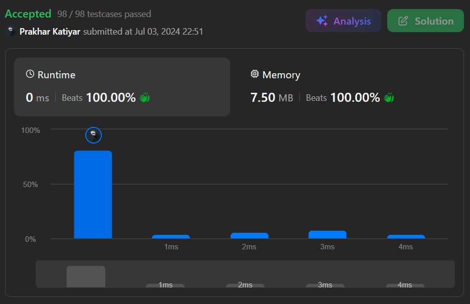

# 20. Valid Parentheses

 

<h2 align="center"> 

<a href="https://leetcode.com/problems/valid-parentheses/description/"><strong>➥ ♻️ 20 Leetcode Que Easy ♻️ </strong></a>
</h2>

 

# Description 📜 ˋ°•*⁀➷

### Given a string s containing just the characters `'('`, `')'`, `'{'`, `'}'`, `'['` and `']'`, determine if the input string is valid.

### An input string is valid if:

- Open brackets must be closed by the same type of brackets.

- Open brackets must be closed in the correct order.

- Every close bracket has a corresponding open bracket of the same type.

 

# Example 💡 1️⃣ ˋ°•*⁀➷

  ### 📥 Input  ➤  s = "()"

  ### 📤 Output  ➤ true

 

# Example 💡 2️⃣ ˋ°•*⁀➷

  ### 📥 Input ➤ s = "()[]{}"

  ### 📤 Output  ➤ true

 

# Example 💡 3️⃣ ˋ°•*⁀➷

  ### 📥 Input ➤  s = "(]"

  ### 📤 Output  ➤ false

 

# Constraints 🔒 ˋ°•*⁀➷

🔹 **1 <= s.length <= 104**  
🔹 **`s` consists of parentheses only `'()[]{}'`.**  

 

# Topics 📋 ˋ°•*⁀➷

🔸 **String**   
🔸 **Stack**   

 

# Solution ✏️ ˋ°•*⁀➷

| 📒 Language 📒  | 🪶 Solution 🪶 |
| ------------- | ------------- |
|    | [JAVA🍁](https://github.com/Prakhar-002/LEETCODE/blob/main/%F0%9F%8F%95%EF%B8%8F%20Quest%20%F0%9F%A7%89/%F0%9F%8D%84%E2%80%8D%F0%9F%9F%AB%20Expedition%20Campaign%202026%20%F0%9F%A6%84/%F0%9F%94%AC%20Examine%20Thoroughly%20%F0%9F%A7%AC/2%20Fighting/Interview%20Instance%206/Q1.%20Valid%20Parentheses/%F0%9F%8D%81JAVA-20-ValidParentheses.java) |
|    | [C++🎲](https://github.com/Prakhar-002/LEETCODE/blob/main/%F0%9F%8F%95%EF%B8%8F%20Quest%20%F0%9F%A7%89/%F0%9F%8D%84%E2%80%8D%F0%9F%9F%AB%20Expedition%20Campaign%202026%20%F0%9F%A6%84/%F0%9F%94%AC%20Examine%20Thoroughly%20%F0%9F%A7%AC/2%20Fighting/Interview%20Instance%206/Q1.%20Valid%20Parentheses/%F0%9F%8E%B2CPP-20-ValidParentheses.cpp)  |
|      | [PYTHON🍰](https://github.com/Prakhar-002/LEETCODE/blob/main/%F0%9F%8F%95%EF%B8%8F%20Quest%20%F0%9F%A7%89/%F0%9F%8D%84%E2%80%8D%F0%9F%9F%AB%20Expedition%20Campaign%202026%20%F0%9F%A6%84/%F0%9F%94%AC%20Examine%20Thoroughly%20%F0%9F%A7%AC/2%20Fighting/Interview%20Instance%206/Q1.%20Valid%20Parentheses/%F0%9F%8D%B0PYTHON-20-ValidParentheses.py) |
|    | [JAVASCRIPT☃️](https://github.com/Prakhar-002/LEETCODE/blob/main/%F0%9F%8F%95%EF%B8%8F%20Quest%20%F0%9F%A7%89/%F0%9F%8D%84%E2%80%8D%F0%9F%9F%AB%20Expedition%20Campaign%202026%20%F0%9F%A6%84/%F0%9F%94%AC%20Examine%20Thoroughly%20%F0%9F%A7%AC/2%20Fighting/Interview%20Instance%206/Q1.%20Valid%20Parentheses/%E2%98%83%EF%B8%8FJAVASCRIPT-20-ValidParentheses.js) |

 

# Benchmark ⏱️ ˋ°•*⁀➷

<h1  align="center" >

</h1>
