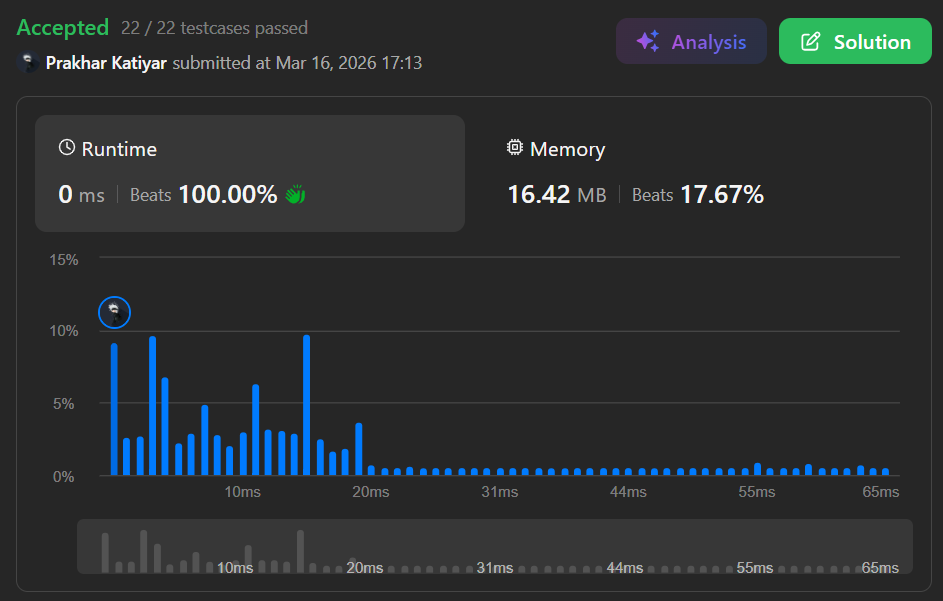

# Q2. Remove All Adjacent Duplicates in String II

 

<h2 align="center">

<a href="https://leetcode.com/problems/remove-all-adjacent-duplicates-in-string-ii/description/"><strong>➥ ☢️ Q2 Leetcode Medium ☢️ </strong></a>

</h2>

 

# Description 📜 ˋ°•*⁀➷
### You are given a string `s` and an integer `k`, a **k duplicate removal** consists of choosing `k` **adjacent and equal** letters from `s` and removing them, causing the left and the right side of the deleted substring to concatenate together.
### We repeatedly make **k duplicate removals** on `s` until we no longer can.
### Return the **final string** after all such duplicate removals have been made. It is guaranteed that the answer is **unique**.

 

# Example 💡 1️⃣ ˋ°•*⁀➷
  ### 📥 `Input`  ➤ s = "abcd", k = 2
  ### 📤 `Output`  ➤ "abcd"
  ### 🔦 `Explanation`  ➤ There's nothing to delete.

 

# Example 💡 2️⃣ ˋ°•*⁀➷
  ### 📥 `Input` ➤ s = "deeedbbcccbdaa", k = 3
  ### 📤 `Output`  ➤ "aa"
  ### 🔦 `Explanation` ➤ First delete "eee" and "ccc", get "ddbbbdaa" → Then delete "bbb", get "dddaa" → Finally delete "ddd", get "aa"

 

# Example 💡 3️⃣ ˋ°•*⁀➷
  ### 📥 `Input` ➤ s = "pbbcggttciiippooaais", k = 2
  ### 📤 `Output`  ➤ "ps"
  ### 🔦 `Explanation` ➤ Repeatedly removing all k=2 adjacent duplicate pairs eventually reduces the entire string down to "ps".

 

# Constraints 🔒 ˋ°•*⁀➷
🔹 `1 <= s.length <= 10^5`  
🔹 `2 <= k <= 10^4`  
🔹 `s` only contains lowercase English letters.  

 

# Topics 📋 ˋ°•*⁀➷
🔸 **String**  
🔸 **Stack**  

 

# Solution ✏️ ˋ°•*⁀➷

| 📒 Language 📒  | 🪶 Solution 🪶 |
| ------------- | ------------- |
|    | [JAVA🍁](https://github.com/Prakhar-002/LEETCODE/blob/main/%F0%9F%8F%95%EF%B8%8F%20Quest%20%F0%9F%A7%89/%F0%9F%8D%84%E2%80%8D%F0%9F%9F%AB%20Expedition%20Campaign%202026%20%F0%9F%A6%84/%F0%9F%94%AC%20Examine%20Thoroughly%20%F0%9F%A7%AC/2%20Fighting/Interview%20Instance%206/Q2.%20Remove%20All%20Adjacent%20Duplicates%20in%20String%20II/%F0%9F%8D%81JAVA%20-%20Remove%20All%20Adjacent%20Duplicates%20in%20String%20II.java) |
|    | [C++🎲](https://github.com/Prakhar-002/LEETCODE/blob/main/%F0%9F%8F%95%EF%B8%8F%20Quest%20%F0%9F%A7%89/%F0%9F%8D%84%E2%80%8D%F0%9F%9F%AB%20Expedition%20Campaign%202026%20%F0%9F%A6%84/%F0%9F%94%AC%20Examine%20Thoroughly%20%F0%9F%A7%AC/2%20Fighting/Interview%20Instance%206/Q2.%20Remove%20All%20Adjacent%20Duplicates%20in%20String%20II/%F0%9F%8E%B2CPP%20-%20Remove%20All%20Adjacent%20Duplicates%20in%20String%20II.cpp)  |
|      | [PYTHON🍰](https://github.com/Prakhar-002/LEETCODE/blob/main/%F0%9F%8F%95%EF%B8%8F%20Quest%20%F0%9F%A7%89/%F0%9F%8D%84%E2%80%8D%F0%9F%9F%AB%20Expedition%20Campaign%202026%20%F0%9F%A6%84/%F0%9F%94%AC%20Examine%20Thoroughly%20%F0%9F%A7%AC/2%20Fighting/Interview%20Instance%206/Q2.%20Remove%20All%20Adjacent%20Duplicates%20in%20String%20II/%F0%9F%8D%B0PYTHON%20-%20Remove%20All%20Adjacent%20Duplicates%20in%20String%20II.py) |
|    | [JAVASCRIPT☃️](https://github.com/Prakhar-002/LEETCODE/blob/main/%F0%9F%8F%95%EF%B8%8F%20Quest%20%F0%9F%A7%89/%F0%9F%8D%84%E2%80%8D%F0%9F%9F%AB%20Expedition%20Campaign%202026%20%F0%9F%A6%84/%F0%9F%94%AC%20Examine%20Thoroughly%20%F0%9F%A7%AC/2%20Fighting/Interview%20Instance%206/Q2.%20Remove%20All%20Adjacent%20Duplicates%20in%20String%20II/%E2%98%83%EF%B8%8FJAVASCRIPT%20-%20Remove%20All%20Adjacent%20Duplicates%20in%20String%20I.js) |

 

# Benchmark ⏱️ ˋ°•\*⁀➷

<h1  align="center" >

</h1>
