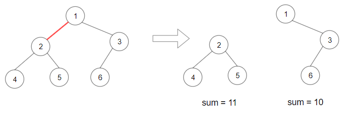
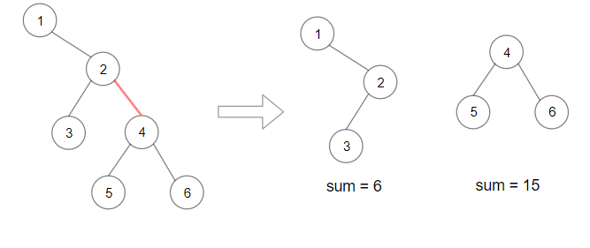
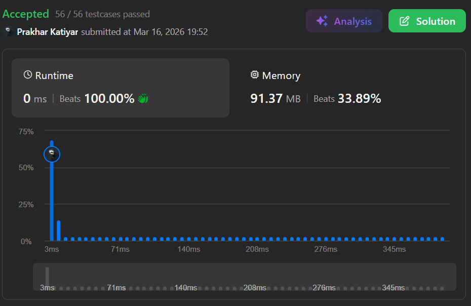

# Q3. Maximum Product of Splitted Binary Tree

 

<h2 align="center"> 

<a href="https://leetcode.com/problems/maximum-product-of-splitted-binary-tree/description/?envType=problem-list-v2&envId=interview-instance-vi"><strong>➥ ☢️ Q3 Leetcode Medium ☢️ </strong></a>
</h2>

 

# Description 📜 ˋ°•*⁀➷
### Given the `root` of a binary tree, split the binary tree into two subtrees by **removing one edge** such that the **product of the sums** of the subtrees is maximized.
### Return the **maximum product** of the sums of the two subtrees. Since the answer may be too large, return it **modulo** `10^9 + 7`.
### Note that you need to **maximize the answer before taking the mod** and not after taking it.

 

# Example 💡 1️⃣ ˋ°•*⁀➷

  ### 📥 `Input`  ➤ root = [1,2,3,4,5,6]
  ### 📤 `Output`  ➤ 110
  ### 🔦 `Explanation`  ➤ Remove the red edge and get 2 binary trees with sum 11 and 10. Their product is 110 (11*10).

 

# Example 💡 2️⃣ ˋ°•*⁀➷

  ### 📥 `Input` ➤ root = [1,null,2,3,4,null,null,5,6]
  ### 📤 `Output`  ➤ 90
  ### 🔦 `Explanation` ➤ Remove the red edge and get 2 binary trees with sum 15 and 6. Their product is 90 (15*6).

 

# Example 💡 3️⃣ ˋ°•*⁀➷
  ### 📥 `Input` ➤ root = [1,2,3]
  ### 📤 `Output`  ➤ 6
  ### 🔦 `Explanation` ➤ Either edge removal gives subtree sums of (1+2)=3 & 3, or (1+3)=4 & 2. Best product is 3*3 = 9, but with sums 2 & 4 → 2*4 = 8, and sums 3 & 3 → 9. Maximum is 6 for a minimal tree split.

 

# Constraints 🔒 ˋ°•*⁀➷
🔹 The number of nodes in the tree is in the range `[2, 5 * 10^4]`.  
🔹 `1 <= Node.val <= 10^4`  

 

# Topics 📋 ˋ°•*⁀➷
🔸 **Tree**  
🔸 **Depth-First Search**  
🔸 **Binary Tree**  

 

# Solution ✏️ ˋ°•*⁀➷

| 📒 Language 📒  | 🪶 Solution 🪶 |
| ------------- | ------------- |
|    | [JAVA🍁](https://github.com/Prakhar-002/LEETCODE/blob/main/%F0%9F%8F%95%EF%B8%8F%20Quest%20%F0%9F%A7%89/%F0%9F%8D%84%E2%80%8D%F0%9F%9F%AB%20Expedition%20Campaign%202026%20%F0%9F%A6%84/%F0%9F%94%AC%20Examine%20Thoroughly%20%F0%9F%A7%AC/2%20Fighting/Interview%20Instance%206/Q3.%20Maximum%20Product%20of%20Splitted%20Binary%20Tree/%F0%9F%8D%81JAVA%20-%20Maximum%20Product%20of%20Splitted%20Binary%20Tree.java) |
|    | [C++🎲](https://github.com/Prakhar-002/LEETCODE/blob/main/%F0%9F%8F%95%EF%B8%8F%20Quest%20%F0%9F%A7%89/%F0%9F%8D%84%E2%80%8D%F0%9F%9F%AB%20Expedition%20Campaign%202026%20%F0%9F%A6%84/%F0%9F%94%AC%20Examine%20Thoroughly%20%F0%9F%A7%AC/2%20Fighting/Interview%20Instance%206/Q3.%20Maximum%20Product%20of%20Splitted%20Binary%20Tree/%F0%9F%8E%B2CPP%20-%20Maximum%20Product%20of%20Splitted%20Binary%20Tree.cpp)  |
|      | [PYTHON🍰](https://github.com/Prakhar-002/LEETCODE/blob/main/%F0%9F%8F%95%EF%B8%8F%20Quest%20%F0%9F%A7%89/%F0%9F%8D%84%E2%80%8D%F0%9F%9F%AB%20Expedition%20Campaign%202026%20%F0%9F%A6%84/%F0%9F%94%AC%20Examine%20Thoroughly%20%F0%9F%A7%AC/2%20Fighting/Interview%20Instance%206/Q3.%20Maximum%20Product%20of%20Splitted%20Binary%20Tree/%F0%9F%8D%B0PYTHON%20-%20Maximum%20Product%20of%20Splitted%20Binary%20Tree.py) |
|    | [JAVASCRIPT☃️](https://github.com/Prakhar-002/LEETCODE/blob/main/%F0%9F%8F%95%EF%B8%8F%20Quest%20%F0%9F%A7%89/%F0%9F%8D%84%E2%80%8D%F0%9F%9F%AB%20Expedition%20Campaign%202026%20%F0%9F%A6%84/%F0%9F%94%AC%20Examine%20Thoroughly%20%F0%9F%A7%AC/2%20Fighting/Interview%20Instance%206/Q3.%20Maximum%20Product%20of%20Splitted%20Binary%20Tree/%E2%98%83%EF%B8%8FJAVASCRIPT%20-%20Maximum%20Product%20of%20Splitted%20Binary%20Tree.js) |

 

# Benchmark ⏱️ ˋ°•*⁀➷

<h1  align="center" >

</h1>
