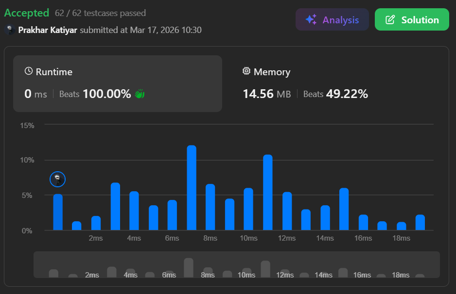

# Q1. Minimum Remove to Make Valid Parentheses

 

<h2 align="center"> 

<a href="https://leetcode.com/problems/minimum-remove-to-make-valid-parentheses/description/?envType=problem-list-v2&envId=interview-instance-vii"><strong>➥ ☢️ Q1 Leetcode Medium ☢️ </strong></a>
</h2>

 

# Description 📜 ˋ°•*⁀➷
### Given a string `s` of `'('` , `')'` and lowercase English characters.
### Your task is to remove the **minimum number of parentheses** ( `'('` or `')'`, in any positions ) so that the resulting parentheses string is **valid** and return **any valid string**.
### Formally, a parentheses string is valid if and only if:
- &nbsp;&nbsp;&nbsp;&nbsp;• It is the **empty string**, contains only lowercase characters, or
- &nbsp;&nbsp;&nbsp;&nbsp;• It can be written as `AB` (`A` concatenated with `B`), where `A` and `B` are valid strings, or
- &nbsp;&nbsp;&nbsp;&nbsp;• It can be written as `(A)`, where `A` is a valid string.

 

# Example 💡 1️⃣ ˋ°•*⁀➷
  ### 📥 `Input`  ➤ s = "lee(t(c)o)de)"
  ### 📤 `Output`  ➤ "lee(t(c)o)de"
  ### 🔦 `Explanation`  ➤ "lee(t(co)de)" , "lee(t(c)ode)" would also be accepted.

 

# Example 💡 2️⃣ ˋ°•*⁀➷
  ### 📥 `Input` ➤ s = "a)b(c)d"
  ### 📤 `Output`  ➤ "ab(c)d"
  ### 🔦 `Explanation` ➤ The unmatched `)` at index 1 is removed, leaving a valid parentheses string.

 

# Example 💡 3️⃣ ˋ°•*⁀➷
  ### 📥 `Input` ➤ s = "))(("
  ### 📤 `Output`  ➤ ""
  ### 🔦 `Explanation` ➤ An empty string is also valid. All 4 parentheses are unmatched, so all are removed.

 

# Constraints 🔒 ˋ°•*⁀➷
🔹 `1 <= s.length <= 10^5`  
🔹 `s[i]` is either `'('` , `')'` , or a lowercase English letter.  

 

# Topics 📋 ˋ°•*⁀➷
🔸 **String**  
🔸 **Stack**  

 

# Solution ✏️ ˋ°•*⁀➷

| 📒 Language 📒  | 🪶 Solution 🪶 |
| ------------- | ------------- |
|    | [JAVA🍁]() |
|    | [C++🎲]()  |
|      | [PYTHON🍰]() |
|    | [JAVASCRIPT☃️]() |
|      | [C💖]()  |
|   | [Explanation✏️]() |

 

# Benchmark ⏱️ ˋ°•*⁀➷

<h1  align="center" >

</h1>
