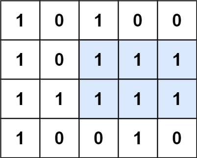
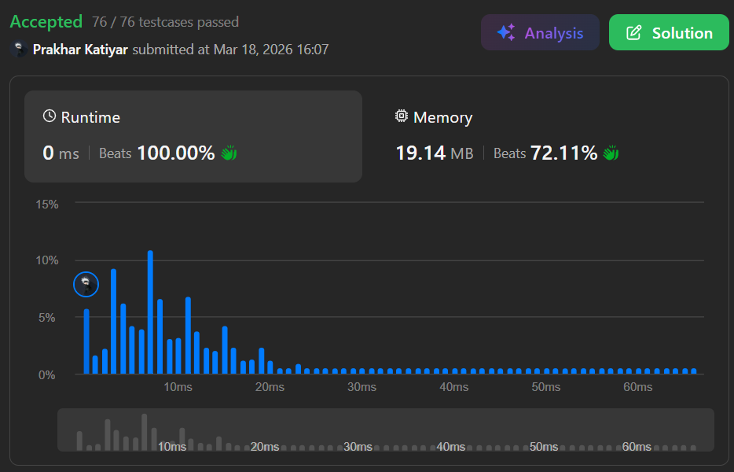

# Q1 Maximal Rectangle

 

<h2 align="center"> 

<a href="https://leetcode.com/problems/maximal-rectangle/description/?envType=problem-list-v2&envId=interview-instance-viii"><strong>➥ ☢️ Q1 Leetcode Medium ☢️ </strong></a>
</h2>

 

# Description 📜 ˋ°•*⁀➷
### Given a `rows x cols` binary `matrix` filled with `0`'s and `1`'s, find the **largest rectangle containing only** `1`'s and return its **area**.

 

# Example 💡 1️⃣ ˋ°•*⁀➷

  ### 📥 `Input`  ➤ matrix = [["1","0","1","0","0"],["1","0","1","1","1"],["1","1","1","1","1"],["1","0","0","1","0"]]
  ### 📤 `Output`  ➤ 6
  ### 🔦 `Explanation`  ➤ The maximal rectangle is shown in the above picture, spanning 2 rows × 3 cols = area of 6.

 

# Example 💡 2️⃣ ˋ°•*⁀➷
  ### 📥 `Input` ➤ matrix = [["0"]]
  ### 📤 `Output`  ➤ 0
  ### 🔦 `Explanation` ➤ The only cell is `0`, so there is no rectangle of 1s. Area is 0.

 

# Example 💡 3️⃣ ˋ°•*⁀➷
  ### 📥 `Input` ➤ matrix = [["1"]]
  ### 📤 `Output`  ➤ 1
  ### 🔦 `Explanation` ➤ The only cell is `1`, forming a rectangle of area 1.

 

# Constraints 🔒 ˋ°•*⁀➷
🔹 `rows == matrix.length`  
🔹 `cols == matrix[i].length`  
🔹 `1 <= rows, cols <= 200`  
🔹 `matrix[i][j]` is `'0'` or `'1'`.  

 

# Topics 📋 ˋ°•*⁀➷
🔸 **Array**  
🔸 **Dynamic Programming**  
🔸 **Stack**  
🔸 **Matrix**  
🔸 **Monotonic Stack**  

 

# Solution ✏️ ˋ°•*⁀➷

| 📒 Language 📒  | 🪶 Solution 🪶 |
| ------------- | ------------- |
|    | [JAVA🍁](https://github.com/Prakhar-002/LEETCODE/blob/main/%F0%9F%8F%95%EF%B8%8F%20Quest%20%F0%9F%A7%89/%F0%9F%8D%84%E2%80%8D%F0%9F%9F%AB%20Expedition%20Campaign%202026%20%F0%9F%A6%84/%F0%9F%94%AC%20Examine%20Thoroughly%20%F0%9F%A7%AC/3%20Ascension/Interview%20Instance%208/Q3.%20Maximal%20Rectangle/%F0%9F%8D%81JAVA%20-%20Maximal%20Rectangle.java) |
|    | [C++🎲](https://github.com/Prakhar-002/LEETCODE/blob/main/%F0%9F%8F%95%EF%B8%8F%20Quest%20%F0%9F%A7%89/%F0%9F%8D%84%E2%80%8D%F0%9F%9F%AB%20Expedition%20Campaign%202026%20%F0%9F%A6%84/%F0%9F%94%AC%20Examine%20Thoroughly%20%F0%9F%A7%AC/3%20Ascension/Interview%20Instance%208/Q3.%20Maximal%20Rectangle/%F0%9F%8E%B2CPP%20-%20Maximal%20Rectangle.cpp)  |
|      | [PYTHON🍰](https://github.com/Prakhar-002/LEETCODE/blob/main/%F0%9F%8F%95%EF%B8%8F%20Quest%20%F0%9F%A7%89/%F0%9F%8D%84%E2%80%8D%F0%9F%9F%AB%20Expedition%20Campaign%202026%20%F0%9F%A6%84/%F0%9F%94%AC%20Examine%20Thoroughly%20%F0%9F%A7%AC/3%20Ascension/Interview%20Instance%208/Q3.%20Maximal%20Rectangle/%F0%9F%8D%B0PYTHON%20-%20Maximal%20Rectangle.py) |
|    | [JAVASCRIPT☃️](https://github.com/Prakhar-002/LEETCODE/blob/main/%F0%9F%8F%95%EF%B8%8F%20Quest%20%F0%9F%A7%89/%F0%9F%8D%84%E2%80%8D%F0%9F%9F%AB%20Expedition%20Campaign%202026%20%F0%9F%A6%84/%F0%9F%94%AC%20Examine%20Thoroughly%20%F0%9F%A7%AC/3%20Ascension/Interview%20Instance%208/Q3.%20Maximal%20Rectangle/%E2%98%83%EF%B8%8FJAVASCRIPT%20-%20Maximal%20Rectangle.js) |

 

# Benchmark ⏱️ ˋ°•*⁀➷

<h1  align="center" >

</h1>
